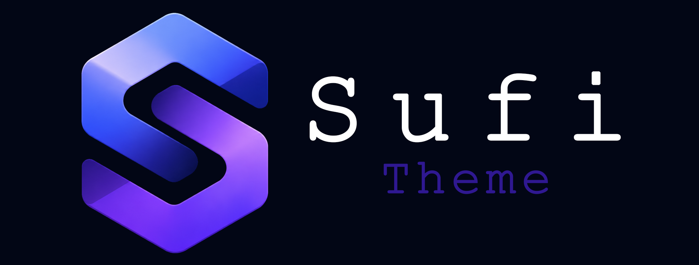

# SufiTheme Documentation

SufiTheme is the official Blazor shell and layout product for Sufi Platform hosts. It owns app chrome (sidebars, top bars, dual-sidebar rails, toolbars). SufiBlazor owns in-content `Sb*` components.

## Start here

| Doc | When to read |
| --- | --- |
| [Overview](sufi-theme-overview.md) | Product role, packages, dependencies |
| [Installation](installation.md) | Add Server or WASM packages to a host |
| [Configuration](configuration.md) | `SufiThemeBlazorOptions`, branding, styles |
| [Layouts](layouts.md) | SideMenu, TopMenu, DualSidebar, Account, Empty |
| [Shell components](shell-components.md) | `SufiAppShell`, sidebars, top bar, mobile chrome |
| [Toolbars](toolbars.md) | Contributor-driven top-bar actions |
| [Public navigation](public-navigation.md) | `IPublicMenuProvider` for KB / marketing menus |
| [Font override](font-override.md) | Custom Latin / RTL fonts |
| [Package map](package-map.md) | Five NuGet packages and dependency graph |
| [Architecture](architecture.md) | Layout resolution, theme classes, ownership split |

## Ownership split

- **SufiBlazor** — interactive components and design tokens (no ABP required)
- **SufiTheme** — host shell, navigation chrome, layout orchestration (requires Sufi Platform UI)
- App shell components that used to live in SufiBlazor (`SbAppShell`, `SbSidebar`, …) were removed; use SufiTheme instead

## Related

- SufiBlazor docs: `../sufi-blazor/docs/README.md`
- Platform docs: `../../sufi-platform/docs/`
